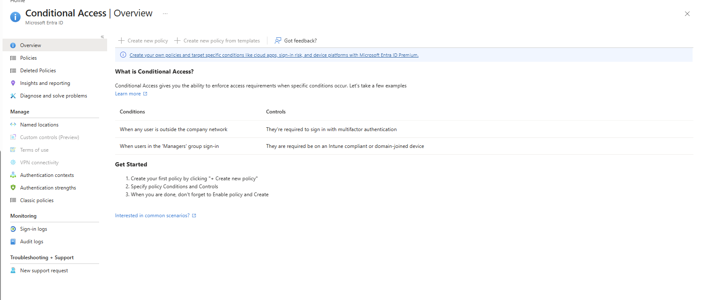
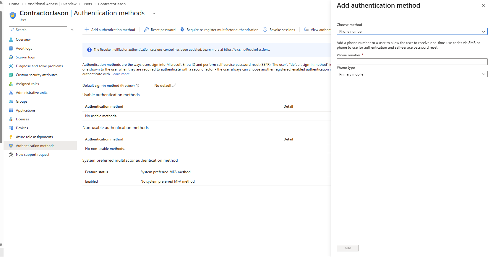
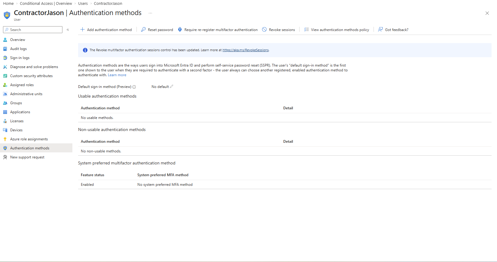

## Day 3 — MFA and Conditional Access

### Objective

Analyze and validate Multi-Factor Authentication (MFA) configurations in Microsoft Entra ID and assess Conditional Access availability within a lab environment.

This lab focuses on understanding how MFA strengthens authentication security and how licensing impacts advanced access control features.

### What I did
- Opened Microsoft Entra admin center
- Navigated to user authentication settings
- Reviewed available MFA method options
- Checked Conditional Access availability
- Documented limitations shown in the lab tenant

### Key Takeaway

MFA is a critical security control in IAM that helps prevent unauthorized access, even if user credentials are compromised.

However, without Conditional Access, organizations cannot enforce advanced policies such as:

- Location-based access restrictions
- Device compliance enforcement
- Risk-based authentication

This highlights the importance of both MFA and Conditional Access working together to secure user access in enterprise environments.

### Skills Demonstrated
- Identity and Access Management (IAM)
- Multi-Factor Authentication (MFA)
- Microsoft Entra ID navigation
- Access control analysis
- Documentation and audit tracking

### Screenshots

#### Conditional Access unavailable (lab limitation)

#### MFA method options

#### MFA methods for user

### Findings

- MFA provides an additional layer of security beyond passwords
- Users without configured MFA methods cannot complete secure sign-in flows
- Conditional Access is not available in this lab due to licensing limitations
- Lack of Conditional Access reduces the ability to enforce advanced security policies (location, device compliance, risk-based access)
- Without MFA, compromised credentials can lead to unauthorized access and potential account takeover
