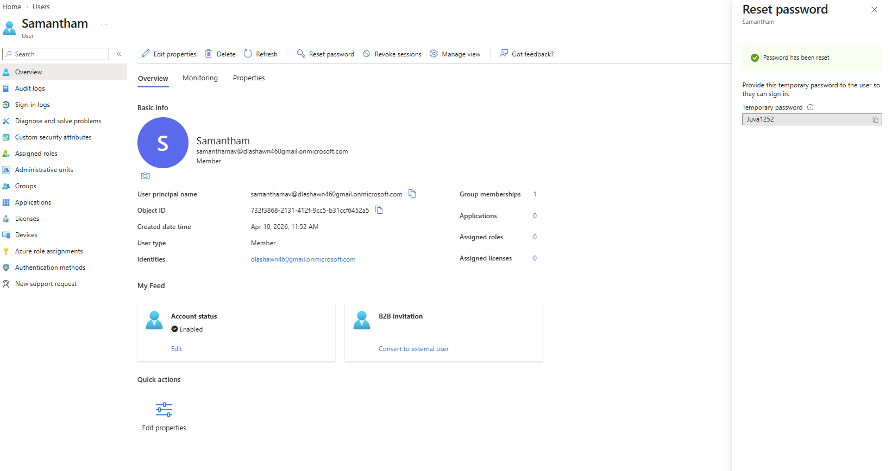
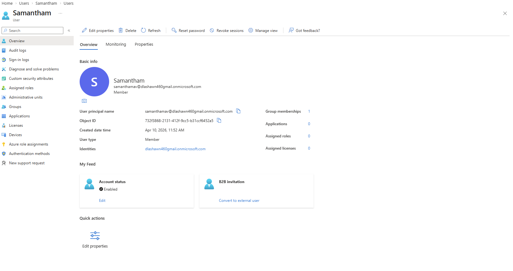
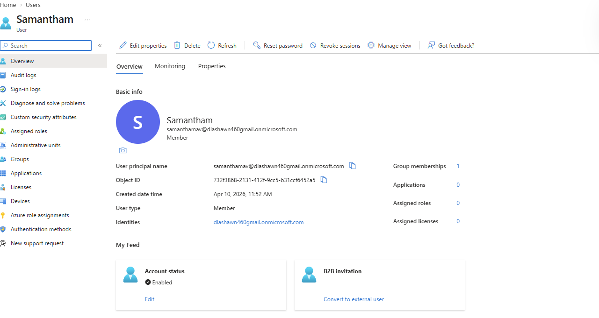

## Day 4 — Password Resets and Sign-In Troubleshooting

### Objective
Simulate real-world IAM support scenarios including password resets, sign-in troubleshooting, and resolving account access issues in Microsoft Entra ID.

---

### Scenario 1 — Password Reset

**Ticket:** User unable to log in due to forgotten password

**Actions performed:**
- Navigated to user profile in Microsoft Entra ID
- Initiated password reset
- Generated temporary password
- Enforced password change at next sign-in

**Outcome:**  
Password successfully reset and user prompted to update credentials on next login.

---

### Scenario 2 — User Cannot Log In

**Ticket:** User reports inability to sign in after password reset  

**Troubleshooting steps:**
- Verified account is enabled (Block sign-in = No)  
- Confirmed password reset completed successfully  
- Reviewed authentication methods configuration  

**Findings:**
- Account was enabled and accessible  
- No authentication methods configured, which may impact MFA prompts

**Outcome:**  
Identified potential MFA configuration issue affecting login experience.

**Root Cause Analysis:**

The login issue was likely caused by missing authentication methods, preventing proper MFA or authentication flow completion after password reset.

  

---

### Scenario 3 — Account Disabled / Access Issue

**Ticket:** User account locked or access denied  

**Actions performed:**
- Simulated issue by disabling user account  
- Verified account status showed disabled  
- Re-enabled account to restore access

**Outcome:**  
User account access successfully restored.

**Root Cause Analysis:**

The access issue was caused by the account being disabled, which blocks all authentication attempts regardless of correct credentials.

  

---

### Key Takeaway

Effective IAM troubleshooting requires a structured approach that includes:

- Verifying account status (enabled/disabled)
- Validating credential changes (password reset)
- Reviewing authentication methods (MFA)
- Identifying configuration gaps impacting access

Even simple misconfigurations can prevent user access, making systematic troubleshooting critical for maintaining secure and reliable identity systems.

---
### Security Insight

Improper account configuration, such as disabled accounts or missing MFA methods, can either block legitimate users or create security gaps.

Ensuring proper authentication setup is essential to balance security and user accessibility.
---
### Skills Demonstrated

- Identity and Access Management (IAM)
- Password reset workflows
- Account troubleshooting
- Multi-Factor Authentication (MFA) analysis
- Microsoft Entra ID administration
- Access issue resolution
- Technical documentation
