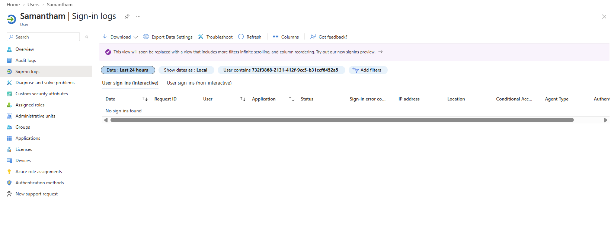

## Day 6 — Sign-In Logs and Security Investigation

### Objective
Simulate real-world IAM investigation scenarios by reviewing user sign-in activity and analyzing authentication logs in Microsoft Entra ID.

---

### Scenario — User Cannot Log In (Log Investigation)

**Ticket:** User reports inability to sign in and requests investigation

---

### Investigation Steps

- Navigated to user profile in Microsoft Entra ID
- Accessed sign-in logs for the user
- Reviewed sign-in activity for the last 24 hours
- Expanded time range to last 7 days for deeper analysis

**Findings:**
- No sign-in activity recorded within selected time ranges
- No successful or failed authentication attempts detected

---

### Analysis

The absence of sign-in logs suggests:
- The user has not attempted to log in recently  
- Login attempts may have occurred outside the selected time window  
- The issue may not be related to authentication failure  

---

### Outcome

No authentication errors identified.  
Further troubleshooting would involve confirming user login attempts and verifying correct credentials or login process.

---

### Key Takeaway

This lab demonstrates how sign-in logs are used to investigate authentication issues. Even when no activity is present, analyzing logs helps rule out authentication failures and guides further troubleshooting steps.

---

### Skills Demonstrated

- Sign-in log analysis
- Security investigation
- Microsoft Entra ID monitoring
- Authentication troubleshooting
- Analytical thinking and problem-solving
